# Git: Working with Branches

## Learning objectives
In this lesson you will:

* Define what a branch is and what they are useful for
* Create a branch and switch between branches
* Make changes to branches 
* Merge branches 
* Explore branch management on GitHub

## What is a branch?

So far we've demonstrated how Git captures a history of your repository in a series of snapshots, made every time you commit a new change to your repository. But what if we want to make some more experimental changes to our repository? Perhaps there is a bug that needs to be fixed, or a new feature we want to add to a pipeline, but we're not quite sure if these changes will work or mesh properly with our main code. Or, maybe we have a collaborator or team of colleagues that are making contributions to the same project, but we want to make sure that we preserve our original repository as-is as a backup before reviewing and incorporating their contributions. For these types of experimental fixes or changes, we can create a new **branch** independent from `main` to make changes to while keeping our `main` safe from any unstable code. This new **branch** will have its own history of commits separate from `main`.

The illustration below shows a repository where each commit is represented by a circle and the edges show their linear relationship. Someone has made a new branch, `Some Feature`, independent from `main`. `Some Feature` has some of its own commits, but that history of commits is separate from `main`:

<p align="center">
  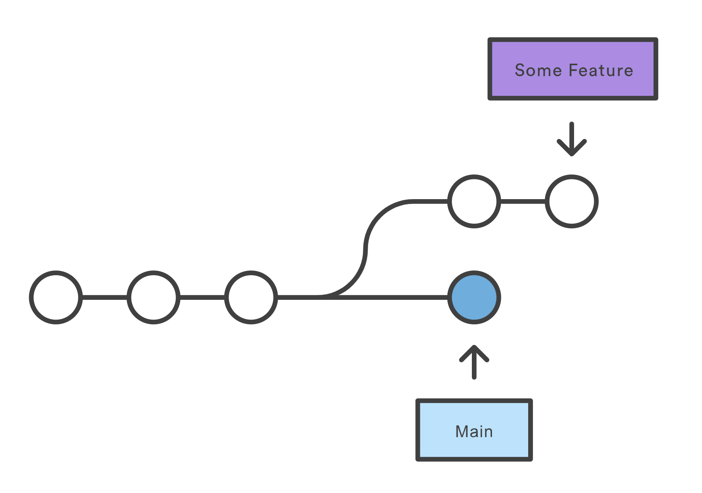
</p>

Image source: https://www.atlassian.com/git/tutorials/using-branches/git-merge

Once you are done perfecting the changes made to the new branch, if you decide you want to keep and incorporate your changes into your `main` repository, you can **merge** the new branch back into `main`. This creates a single, unified repository again:

<p align="center">
  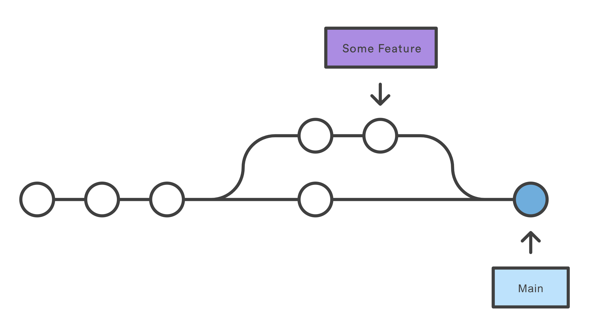
</p>

Image source: https://www.atlassian.com/git/tutorials/using-branches/git-merge

Or, if you only want to incorporate some of the changes, you can **cherry-pick** those commits to `main`. Or, if your experimenting didn't work, you can keep the whole branch separate and continue working on it or ignore it altogether, without jeopardizing `main`.

## How to create a branch 

To create a new branch locally in git, type:

```{.bash}
$ git checkout -b test_branch
```

~~~ {.output}
Switched to a new branch 'test_branch'
~~~

You can name your branch anything, by replacing `test_branch` with your name of choice.

You can check which branch you are in by running `git status`:

```{.bash}
$ git status
```

~~~ {.output}
On branch test_branch
nothing to commit, working tree clean
~~~


## Switching between branches

Earlier, we mentioned that branch histories are independent. That means that you can continue making changes to `main` even though you are working in a new branch. You can switch back and forth between branches easily using `git checkout`.

```{.bash}
$ git checkout main
```

~~~ {.output}
Switched to branch 'main'
Your branch is up to date with 'origin/main'.
~~~


For now though, let's stay in `test_branch`

```{.bash}
$ git checkout test_branch
```


**What if I decide I want to delete a branch?**

Maybe you have abandoned your experimental code and want to clean up the clutter. To delete a branch, use `git branch -d <branch_name>`:

```{.bash}
$ git branch -d test_branch
```

~~~ {.output}
error: cannot delete branch 'test_branch' used by worktree at '/Users/shaynastein/Documents/gitrepos/planets
~~~

You can't delete a branch while you are in that branch!.

```{.bash}
$ git checkout main
$ git branch -d test_branch
```

~~~ {.output}
Deleted branch test_branch (was 9c3c3cd).
~~~

Now we have deleted `test_branch`

## Making changes (commits) to your new branch

Making a change to a branch is just like making a change to `main`. Let's give it a try. 

Let's remake `test_branch`

```{.bash}
$ git checkout -b test_branch
```


Now add this line to the README file:

```
This line was made in the test branch!
```

Run `git status`:

```{.bash}
$ git status
```

~~~ {.output}
On branch test_branch
Untracked files:
  (use "git add <file>..." to include in what will be committed)
	README.md

nothing added to commit but untracked files present (use "git add" to track)
~~~

Add and commit the changes to `test_branch`:

```{.bash}
$ git add README.md
$ git commit -m "adding info to the README"
```

~~~{.output}
[test_branch fc35fd5] adding info to the README
 1 file changed, 1 insertion(+)
 create mode 100644 README.md
~~~

And that's all there is to it! If you were to set your current branch to `main` and open `README.md` file, that line of text we added would not be there, because the change we made is unique to `test_branch`. Go ahead and see for yourself!

```{.bash}
$ git checkout main
$ cat README.md
```

### Publishing/pushing your branch to GitHub

One last step: let's publish our new branch to GitHub.  Be sure your branch is `test_branch` and not `main` if you had switched it to the `main` branch inspect the `README.md`.

```{.bash}
$ git push
```

~~~ {.output}
fatal: The current branch test_branch has no upstream branch.
To push the current branch and set the remote as upstream, use

    git push --set-upstream origin test_branch

To have this happen automatically for branches without a tracking
upstream, see 'push.autoSetupRemote' in 'git help config'.
~~~

We have to set an upstream branch for `test_branch` because it doesn't exist on the remote yet.

```{.bash}
git push --set-upstream origin test_branch
```

~~~{.output}
Enumerating objects: 4, done.
Counting objects: 100% (4/4), done.
Delta compression using up to 8 threads
Compressing objects: 100% (2/2), done.
Writing objects: 100% (3/3), 396 bytes | 396.00 KiB/s, done.
Total 3 (delta 0), reused 0 (delta 0), pack-reused 0 (from 0)
remote:
remote: Create a pull request for 'test_branch' on GitHub by visiting:
remote:      https://github.com/sstein93/planets/pull/new/test_branch
remote:
To https://github.com/sstein93/planets.git
 * [new branch]      test_branch -> test_branch
branch 'test_branch' set up to track 'origin/test_branch'.
~~~

Now the remote is up-to-date with the local!

**Note: If you already published your branch to GitHub and then make additional changes, you'll still have to Push your new changes to GitHub to sync your remote repository and create a pull request**

## Merging branches

Once you're done making changes to your new branch, and you've decided you want to keep these changes and incorporate them into your `main` repo, you will want to **merge** branches back together. This will keep your repository organized so you don't end up with lots of different branches with lots of different versions. To do this, we'll be making a **pull** request from `main`. 

### Making a pull request to merge branches

We're going to merge `test_branch` with `main` via a **pull request**. You'll notice a new highlighted box with a blue button that gives the option to **`Preview Pull Request`** (you may notice that this button has a drop down menu to skip straight to `Create Pull Request`, but we recommend reviewing your pull request first):

<p align="center">
  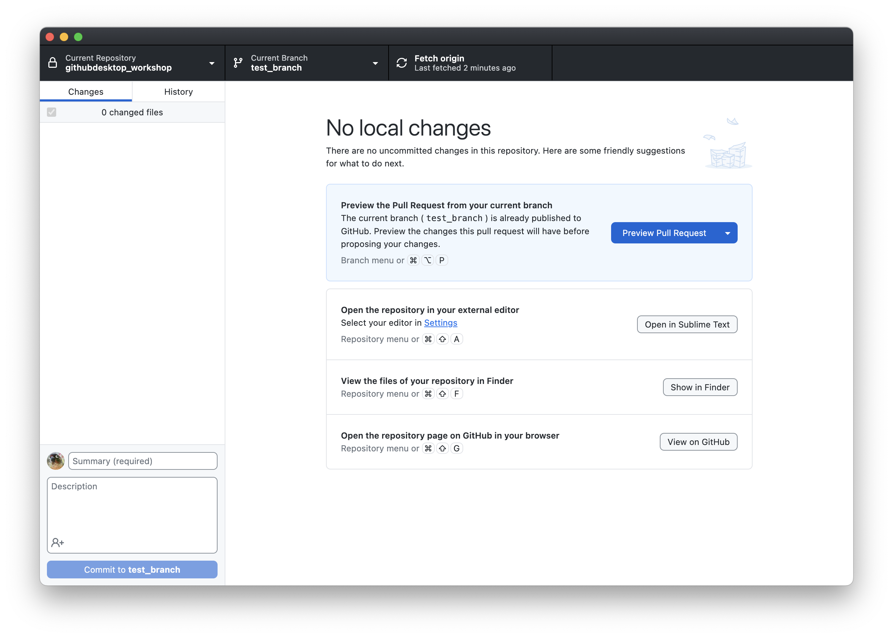
</p>

If you click this button, it will pull up a summary of changes, with the option to **`Create Pull Request`**:

<p align="center">
  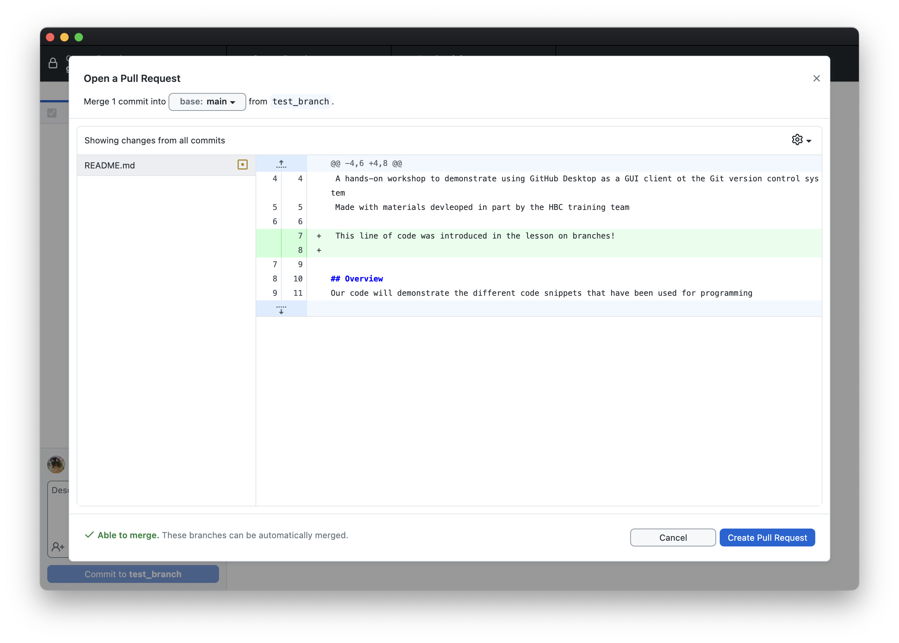
</p>

Clicking this will immediately open your repo on GitHub. Similar to when making a commit, you'll be prompted for a title and a description for your pull request. Go ahead and add a brief description and click the green **`Create pull request`** button

<p align="center">
  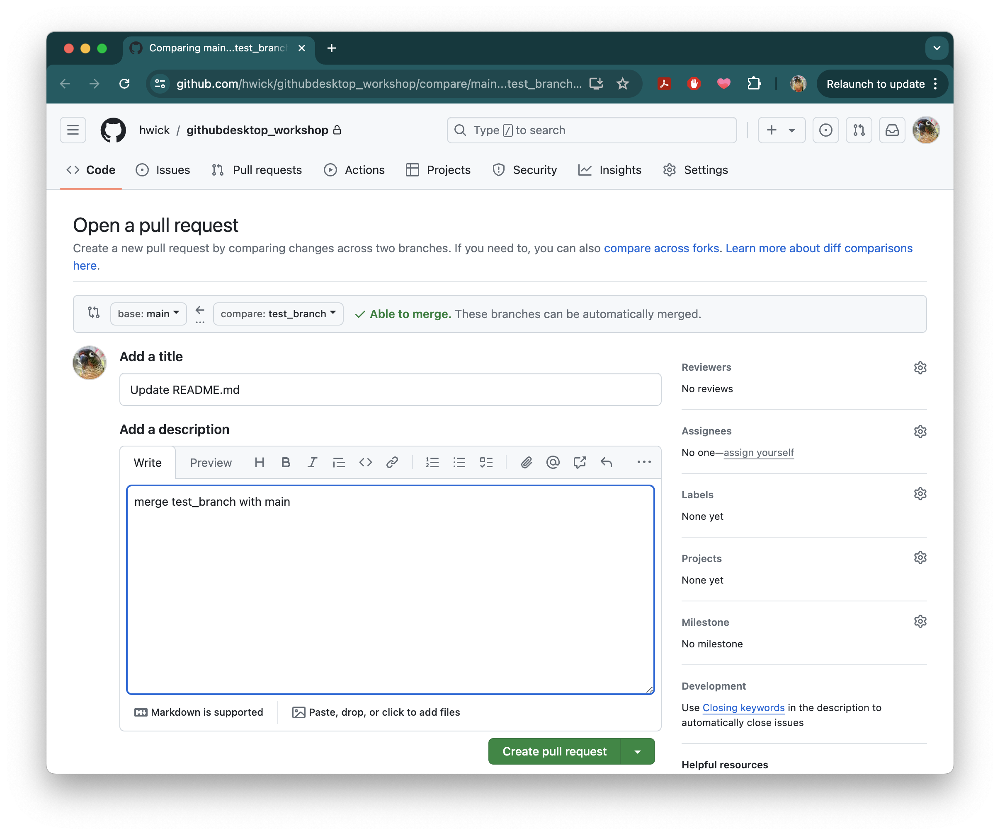
</p>

> Note: you'll see a message up top here that says "Able to merge. These branches can be automatically merged." There may be cases where your branches conflict, just as commits can conflict, and they'll need to be manually reviewed.

After a moment of processing, the page will show you a number of useful options, including the ability to **require review from specific users** (useful if you have multiple people working on a project that belongs primarily to one person who is the main editor) or to turn on debugging options through **continuous integration**. Notice we have a nice green checkmark indicating that **This branch has no conflicts with the base branch** meaning we can merge these branches automatically without having to review any conflicting changes between `main` and `test_branch` manually.

<p align="center">
  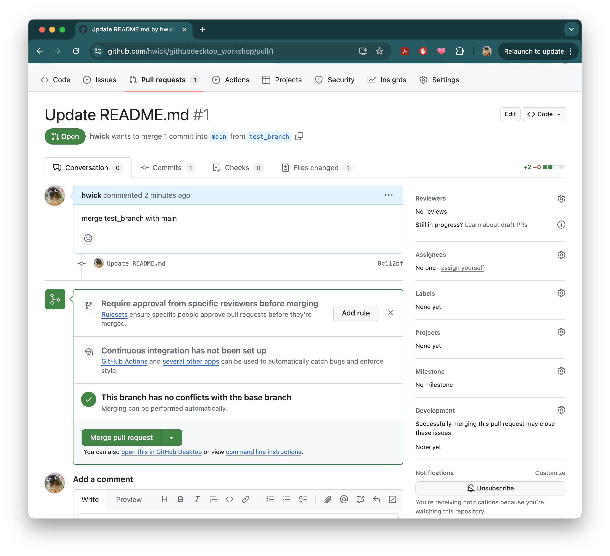
</p>

Under that is a big green button that says **`Merge pull request`**.

>**Side note:** If you click the arrow on the `Merge pull request` button, you'll notice several options. The vast majority of the time you'll just want to use the default option, but here is a description of all available options:
>
>**1) Create a merge commit** -- This will add all commits we made to the `test_branch` into `main`. This is useful for seeing individual changes that were made and even changing them down the road. If changes were also made in `main`, the commits will be interleaved.
>
>**2) Squash and merge** -- This will condense, or "squash", all the commits from `test_branch` into a single commit. This is useful if you know you won't want to make any changes to individual commits after merging, or don't need the complete history from the `test_branch`
>
>**2) Rebase and merge** -- This will add all commits from `test_branch` to the end of `main` but not create an extra commit -- this makes a somewhat cleaner history but does not indicate a merge commit

Go ahead and merge your branches using the default setting, clicking the green `Merge Pull Request` button.
Then, you'll be prompted to **`Confirm merge`**:

<p align="center">
  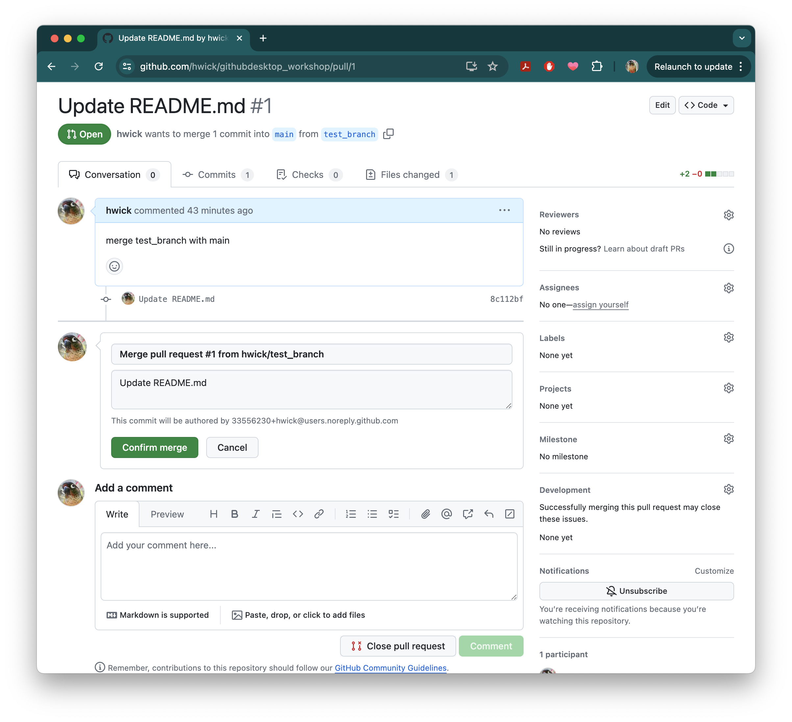
</p>

You'll now see that the pull request has been completed on GitHub.

<p align="center">
  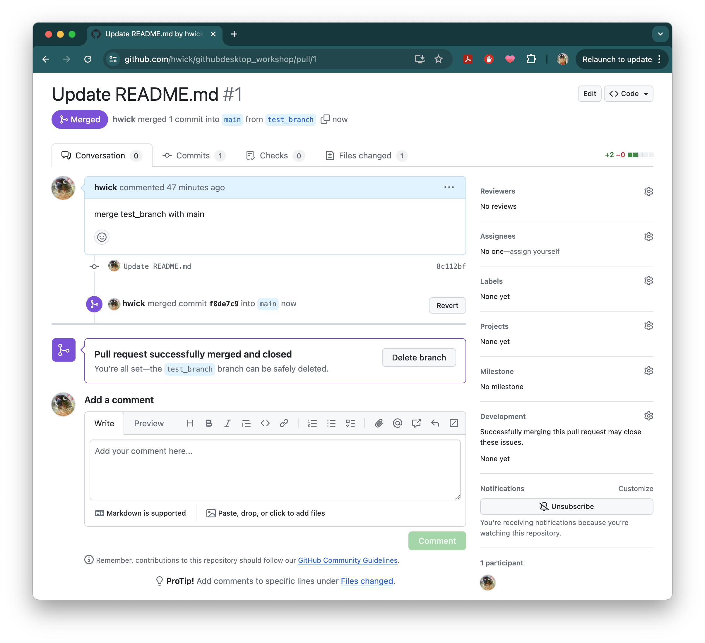
</p>

Now we still have to sync our remote origin with our local repo. You'll see you now have a pull request:


<p align="center">
  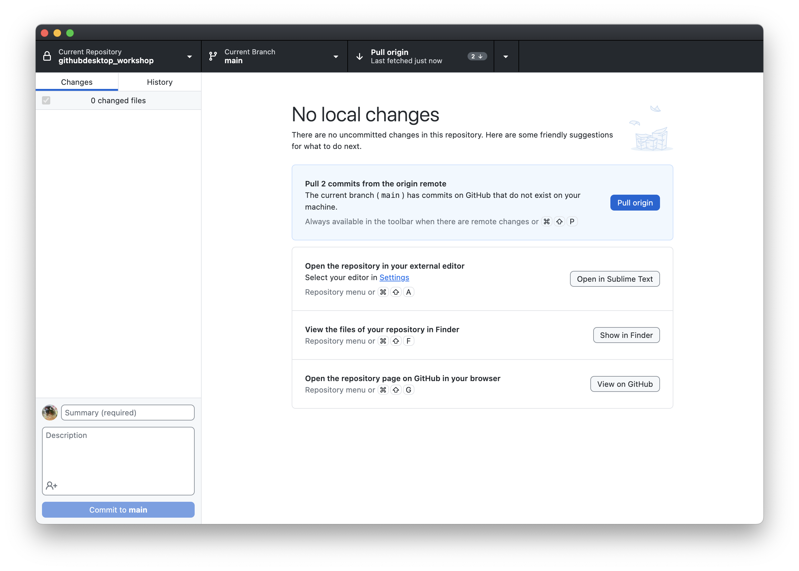
</p>

Go ahead and click `Pull origin` and then navigate to your `History` tab, and you'll see the commit from `test_branch` which updated the `README.md` file as well as the commit which merged the two branches:

<p align="center">
  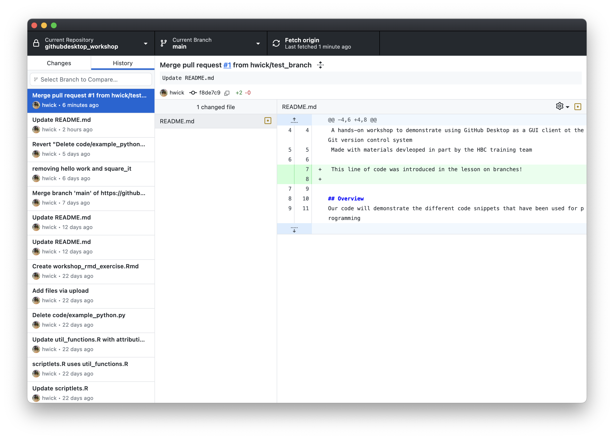
</p>

## How to create a branch on GitHub

We've already been through how to create a pull request and merge branches on GitHub because making a pull request on GitHub Desktop requires GitHub, but it may be useful for you to know how to create a branch on GitHub as well.

From your repository on GitHub, click on the `main` button in the upper left and you'll see an text box with the prompt to "Find or create a branch." Give your branch an appropriate name (we chose `remote_test_branch`), then click **`Create`** directly below:

<p align="center">
  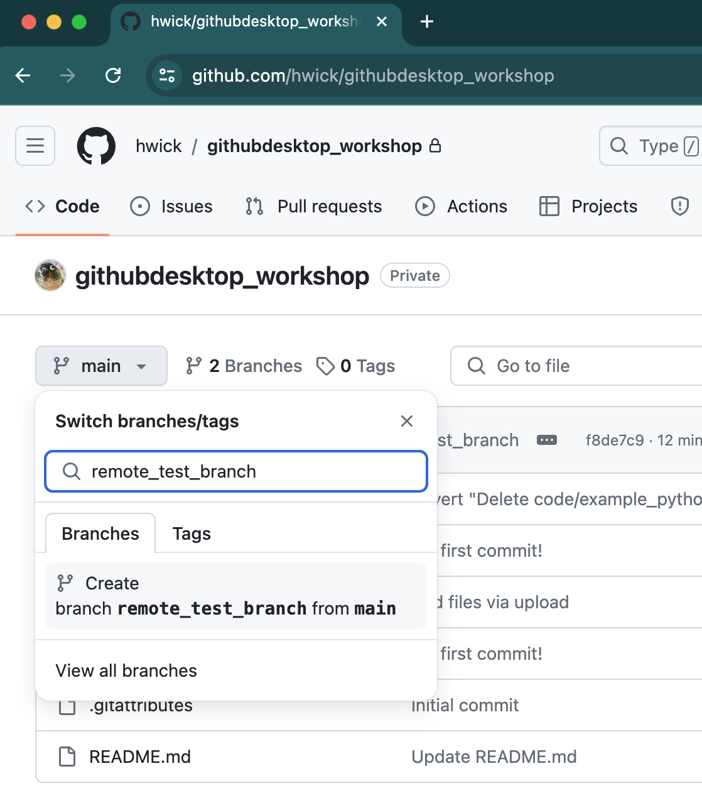
</p>

Once you've created your branch, you can even see the new branch on GitHub Desktop (you may need to `Fetch origin` in order to be able to see it):

<p align="center">
  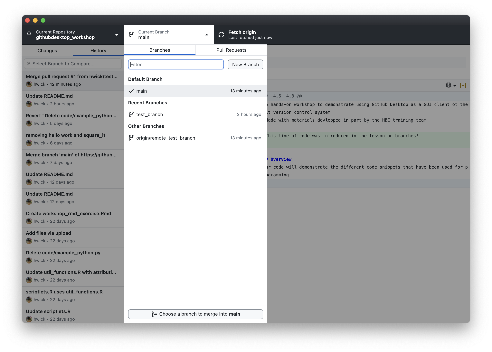
</p>

Let's try making a change to this branch. Add the following line to your `README.md` file on GitHub, then observe any changes to your local repo in GitHub Desktop.

```
 This line was introduced on my remote branch!
```

<p align="center">
  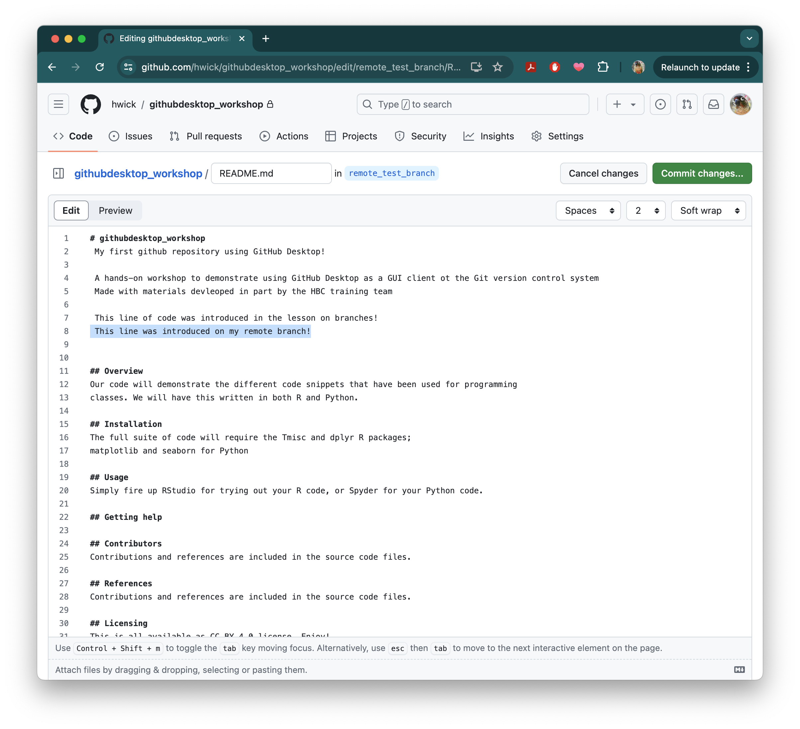
</p>

You'll see these changes are automatically pushed to the your local `remote_test_branch` and are visble on GitHub.

<p align="center">
  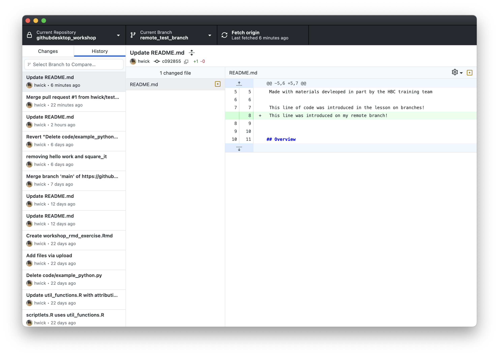
</p>

## Merging directly from GitHub.com

If you click on the **`Pull request`** button in the upper left, you'll be brought to a new screen and see an option to **`Compare & pull request`** changes that GitHub has noticed in your new test branch:

<p align="center">
  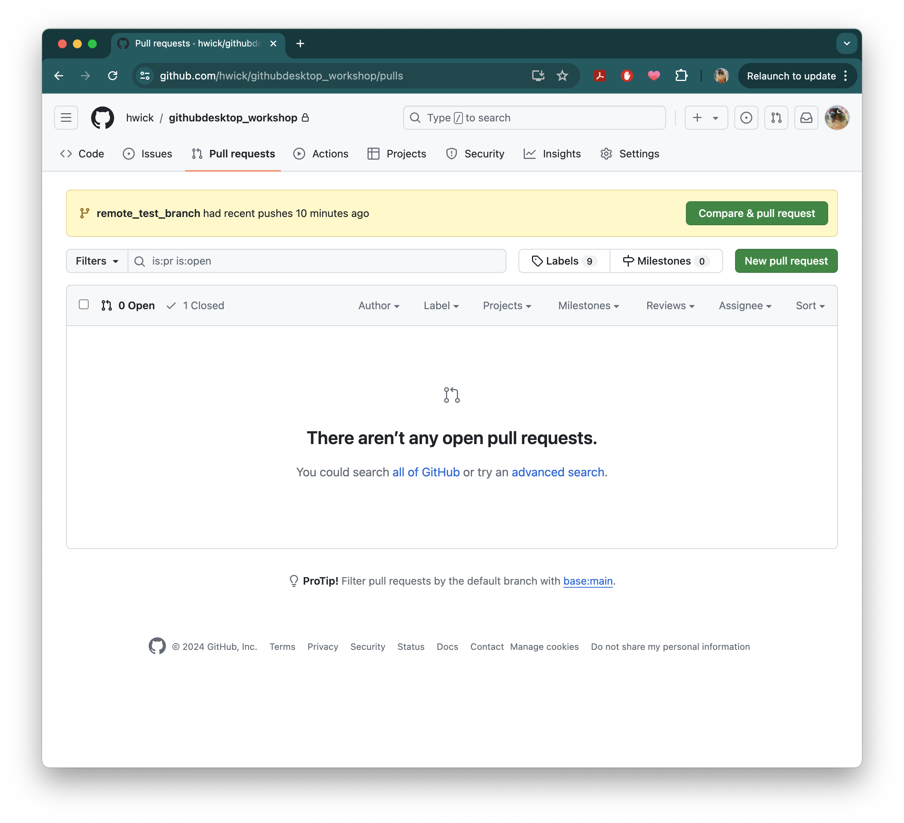
</p>

Clicking this button will bring you to a similar screen we saw before when initiating a pull from GitHub Dekstop. Go ahead and create the pull request, then confirm the pull request, just as before. Once you have confirmation that it's been synced, you can `Pull origin` to see that GitHub Desktop will have the merge incorporated to `main`.

***

* This document adapted is from: https://github.com/hbctraining/Tools-for-reproducible-research/blob/master/lessons/09_branches.md
* Information in these materials derived from docs.github.com and https://www.atlassian.com/git/tutorials/using-branches


